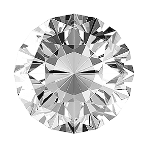

# Ironhack Machine Learning Project
For this project, after doing an exploratory data analysis report, in order to gain initial insight on the diamonds dataset, an algorithm has been made, with machine learning techniques, to predict the price of a diamond as exact as possible, according to all the variables previously analyzed.

The main objective of this project is predicting the price of the diamond, with the less error possible, having into account, diamonds three main qualities, clarity, cut and color, and their influence to the price depending on the carat size.





### 💻 **Data**:
The Dataset used for this project is Diamonds.csv, a Diamonds dataset with more than 40.000 diamonds

### **Name**
The Ultimate Machine Learning predictive price Algorithm

### 💥**Core technical concepts and inspiration**
Thanks to the exhaustive analysis on diamonds qualities in a previous Analytic project, an attempt has been made to make the algorithm that best predicts the price, depending on how the variables affect each other.

### 💻 **Technology stack**
- Exploratory Analysis dataset: Python, Pandas, Numpy, Seaborn, Matplotlib, Pyplot
- Machine Learning: Scikit-learn, lightgbm, GradientBoost, RandomForest

### 🔧 **Configuration & Usage**
We just need to have python and the libraries requiere to run the models purposed.

### 📁 **Folder structure**
```
└── project
    ├── Data
    ├── notebooks
	├── models
	├──submissions
    │ 
    └── README.md
```

### 💌 :link: **Contact info**
- LinkedIn: https://www.linkedin.com/in/juan-de-diego-suanzes/
- Github: https://github.com/juanema74
- Tableau: https://public.tableau.com/profile/juan.de.diego#!/?newProfile=&activeTab=0
- Email: Juandediegosuanzes@gmail.com
- Phone: 636277330